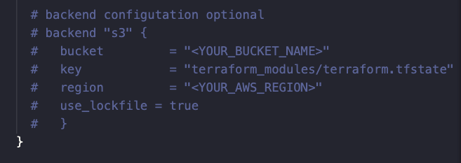

# Feature Flags Infrastructure

A collection of Terraform configurations that provision an entire AWS infrastructure for [feature-flags-app]([feature-flags-app](https://github.com/shaarron/feature-flags-app)).

## Repository layout
- [modules](#modules) 
- [terraform](#terraform)
- [terraform_backend](#terraform_backend)
- [workspaces](#workspaces)

### [modules](modules)

| Module                   | Purpose                                                                                                                                      |
|--------------------------|----------------------------------------------------------------------------------------------------------------------------------------------|
| `cloudfront/`            | Configures a CloudFront distribution with OAC/OAI, custom cache policies, and Route 53 aliases.                                             |
| `ebs-csi-storageclass/`  | Creates EBS CSI storage classes (e.g., gp3), sets one as default.                                                                            |
| `network/`               | Creates the VPC, subnets, route tables, IGWs, NAT gateways.                                                                                   |
| `route53/`               |  Creates DNS records for S3/CloudFront/NLB                                                     |
| `s3/`                    | Creates S3 buckets with encryption and access control.                                  |
| `oidc/`                  | Sets up IAM OIDC provider for GitHub Actions → AWS role assumption (used for CI/CD with federated access).                                  |

  

### **[terraform](terraform)**

The main Terraform root module. 
It wires together all the above modules for a complete infrastructure stack.

- `main.tf` – Orchestrates all core modules (VPC, EKS, storage, etc.)
- `providers.tf` – AWS, Kubernetes, Helm provider configurations.
- `variables.tf` – Input variable definitions.
- `terraform.tfvars` – Default shared across environemnts variable values.
- `outputs.tf` – Useful outputs like DNS names, ARNs, endpoints.
  

###  **[workspaces](workspaces)**

Environment-specific variable overrides to support **multi-env deployments**.

 `dev.tfvars`, `staging.tfvars`, `prod.tfvars`


### **[terraform_backend](terraform_backend)**

Provisioning the remote S3 backend for Terraform state.
- Creates encrypted S3 bucket with versioning.
- Applies secure public access blocking and bucket policies.
  


## Prerequisites

- Terraform (>= 1.0 recommended)
- AWS CLI configured with appropriate credentials and region
- Prepare terraform.tfvars for each module with the required variables.

## Required AWS Permissions & IAM Roles

To successfully apply this Terraform configuration, the IAM user or role running this Terraform must have administrator-level permissions(Create, Read, Write and Delete) over the following services:

- **EKS**

- **IAM**

- **EC2** 
  
- **EBS**

- **S3**

- **CloudFront**

- **Route 53**

- **ACM**

- **CloudWatch Logs**


## Getting started

### 1. Configure Workspace 
Create workspace based on the required env(prod, dev, staging):

(*e.g using dev environment) 
```
terraform workspace new dev
```

Swtich to the workspace:
```
terraform workspace select dev
```

### 2. Remote State
If you want to use a **remote state**, you shoud configure it first.

you can create a new bucket or use your own

#### To create a remote backend


```
cd terraform_backend/
terraform init
terraform apply
```

#### To configure backend

 Update the backend configuration with your backend s3 bucket info, in the following path:   
  [terraform/providers.tf:14-20](terraform/providers.tf)
    
   


#### 3. Deploy the whole setup

once you done configuring remote backend, cd into **terraform/** and run the **[terraform commands](#terraform-commands)** based on your env.

```
cd terraform/
```

### Terraform commands
for each step use the following commands:

(*example using dev environemnt)
```
terraform init
```

```
teraform workspace new dev
```

```
terraform plan -var-file="../workspaces/dev.tfvars" 
```
```
terraform apply -var-file="../workspaces/dev.tfvars"
```


   


## Troubleshooting

Below are some common Terraform issues you might encounter during deployment and their typical resolutions.

### Error: `Invalid value for input variable`

**Cause:**  
The `terraform.tfvars` or environment-specific `*.tfvars` file is missing required variables, or a variable is passed with the wrong type (e.g., string instead of list).

**Fix:**  
- Double check the variables required in `variables.tf`.
- Validate your inputs using:
  ```bash
  terraform validate
  terraform plan -var-file="workspaces/dev.tfvars"


### Error: 403 AccessDenied (across AWS resources)

**Cause:**  
Your IAM user, role, or federated identity (e.g., GitHub OIDC) lacks the necessary permissions to access an AWS resource — such as S3, Route 53, CloudFront, IAM, or EKS.

**Fix:**  
- Confirm your current identity:
  ```bash
  aws sts get-caller-identity
   ```

- Check whether the identity has the appropriate actions for the resource type, e.g.:

   * S3 → s3:GetObject, s3:PutObject, s3:ListBucket, s3:DeleteObject

   * Route53 → route53:ChangeResourceRecordSets, route53:ListHostedZones

   * IAM/OIDC → iam:PassRole, iam:GetRole, iam:CreateOpenIDConnectProvider

